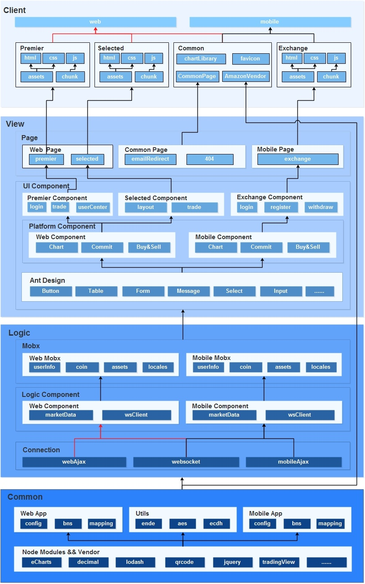
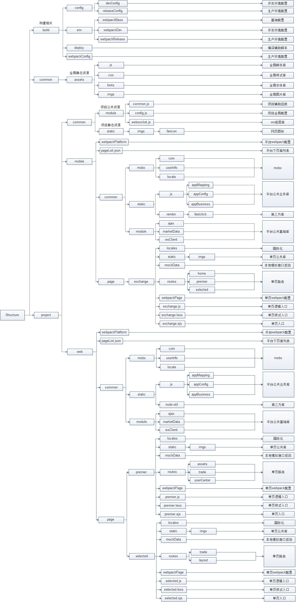

[TOC]

#1.快速启动

##1.1 安装node_modules
```sh
npm install
```

##1.2 添加开发环境编译配置文件
在build/config目录下添加devConfig.json文件，内容如下：
```javascript
{
    "projectName": "OSA",
    "host": "",
    "port": "",
    "deployContent": {
      "web": [],
      "mobile": []
    },
    "mode": "",
    "localDevServer": "https://www1.xdaex.com"
}
```
以上配置的含义将在下述章节中详细阐述。

##1.3 启动开发环境热更新编译
```sh
npm start
```

##1.4 访问本地站点
在浏览器地址栏中输入
```sh
http://localhost:6060/web/exchange/exchange.html
```
查看开发环境编译结果

#2.框架主要功能介绍

##2.1 跨平台开发模式
支持桌面版和移动版双平台同时开发模式，支持跨平台组件复用，减少开发成本。生产模式支持跨平台零耦合的项目输出以及公共模块的提取。

##2.2 单页多页混合编译
支持单页应用与多页应用混合编译的模式，单页应用支持react,vue和angular等主流单页框架及其全家桶技术栈。

##2.3 本地服务器转发
支持接口联调中服务器转发以及本地mock数据模拟响应模式。

##2.4 远程deploy
支持将产出的代码直接输出到远程服务器上实现快速更新。

#3.架构图

##3.1 概要设计图


- 整个架构从上至下分为client,view,logic和common四个层次。每个层级的颜色深浅也有特殊含义，层级颜色越深的表示逻辑越重，越靠近顶层的部分越接近业务本身逻辑，越往下逻辑越抽象，各部分逻辑功能的复用度也最高。
- Client即用户实际访问网站时获取到的网站内容结构，同时该层也规范了生产环境的输出结构，为运维部署静态资源提供有价值的参考依据。并且client层要求各平台下各类项目之间零耦合，可以单独打包部署。当前版本的交易所项目中共需要输出如下内容：
-web
--exchange //web端主板及其他
--SelectMarket //web端创新板
-mobile
--exchange //移动端主站
-common //全局公共模块，如tv,antd等
- View层指的是用户交互层，即UI和UX部分。这部分的内容最终输出的是html网页，而这些视图页面又是由各类视图子组件组成的，组件间实现高度可复用，最底层的UI组件库直接使用的antd系列。
- Logic层包含了全部数据通信及处理的逻辑代码。为了实现全局数据通信我们引入了mobx来管理数据驱动部分的功能。同时根据react技术栈的特性，我们将逻辑处理部分封装成react的逻辑组件来实现。并且根据交易所项目的特点在与服务端通信时采用了ajax和websocket两种模式。
- Common层负责整个框架复用度最高部分的逻辑代码，包含所有的第三方node_modules库以及各种在具体业务开发中能够被抽象出的逻辑。这一层的代码内容最终也会输出到Client层的common目录中，作为全局公共库被各页面调用。

##3.2 详细设计图

详细设计图从代码仓库的实际结构角度出发，详细阐述了每个目录与文件的作用，方便新入手的开发同事可以快速的对整个项目结构有所了解。每个模块具体的作用已在图中有所注明，因此就不再在文档中重复说明。


#4.使用说明
##4.1 编译说明
由于此次重构后的框架支持web端和mobile端跨平台编译，但在实际开发过程中，不同平台下页面的维护是交给不同的开发人员来实现的，因此每个人对于实际需要编译的内容需求都不同。特在此框架中将编译相关的配置文件进行抽离，并给予每个开发人员各自配置的权限。

##4.2 devConfig
该文件是用以配置开发环境编译选项时所使用的，诸如4.1中所提到的开发环境下每位开发人员均可自行编辑该文件以实现自己的开发需要，因此在git仓库中该文件是必须被添加到ignore清单中的。也由此，该文件在开发者第一次从git仓库拉取时是不存在的，必须由开发者根据规范自行创建，文件中所包含的配置项如下：
```javascript
{
    "projectName": "OSA",
    "deployContent": {
      "web": ["SelectMarket"]
    },
    "mode": "",
    "localDevServer": "https://www1.xdaex.com"
}
```
- projectName描述了当前开发的项目名称，原则上约定一个git仓库只允许维护一个项目，而一个项目可以包含多个平台（web/mobile）下的多个单页或多页结构的页面。因此，无论是开发环境还是生产环境的编译都指的是编译该项目下的内容。该字段取值类型就是单一字符串。
- deployContent描述了具体需要编译该项目下的哪些页面。由于项目下第一层结构是平台，因此该字段的取值是一个由多平台组成的key/value的对象结构，key就是平台名称，又由于平台下可能存在多个页面，因此value的取值是个数组，数组的内容既是需要编译的页面名称。关于该字段的取值有以下注意点：
--不可以为空，至少需要编译一个平台的一个页面
--如果没有某个平台的key（如例子中没有mobile这个key），即表示不编译该平台下的任何一个页面。
--如果有平台的key但对应的value值为空数组，即表示编译该平台下的所有页面。
--如果有平台的key且value值的数组有值，即编译数组中值对应的页面。
- mode指的是mockServer开关，值是布尔类型。如果设置为true那当向服务器发送请求时，会直接将本地文件作为response进行返回，具体接口与返回本地文件的规则如下：
假设在web平台下有个demo页面中会访问接口名/a/b/c，则框架会去寻找/web/demo/mockData/a/b/c.json文件，并将其作为ajax的response进行返回。平台名，页面名和接口名组成的路径与文件实际路径同构。如果设置为false，那ajax请求会直接与服务器进行通信。
- localDevServer。即便有了本地mockServer可以实现简单的前后端分离开发模式，但一些复杂的接口调试还是需要访问真实服务器才能实现。而在本地开发过程中我们的ajax请求全部都是跨域的，如果还想继续访问真实服务器地址就必须在开发环境启动代理模式。该字段就是用来设置本地代理服务器转发真实服务器时描述真实服务器地址永的。字段的值既是真实服务器地址。由于devConfig.json文件是开发人员自行维护的，因此该联调服务器的地址可以根据实际开发需要来设置。

##4.3 releaseConfig
该文件是用以配置生产环境输出时所使用的，具体配置例子如下：
```javascript
{
    "projectName": "OSA",
    "deployContent": {
        "web": [],
        "mobile": []
    }
}
```
可以看到相对于开发环境的配置项少了mode和localDevServer两个字段。这是因为这两个字段是用于开发环境联调时所使用的，而生产环境的联调一定是与真实服务器地址进行通信的，所以不再提供其他实现方式，也就不需要这两个配置项了。例子中的配置表示需要编译web和mobile双平台下的所有项目。

##4.4 pageList
该文件存放于每个平台所对应的目录的第一层，例如web平台下该文件路径就是/web/pageList.json。在4.2节中我们提到了deployContent的值中某个平台key下的取值可以设置为空数组，这种设置下框架会将该平台下所有的页面都进行编译输出。对于这个所有页面名称的默认设置就是在pageList文件中操作的，而这里的"所有"指的也就是该文件中涉及到的页面名称，那些存在于平台目录下但并没有在pageList文件中添加的页面是不会进行编译输出操作的。
例如web目录下有a,b,c和d三个页面对应的目录，但/web/pageList.json中只写了a,b,c三个页面的名称，则d页面就不会进行编译和输出了。

##4.5 命名空间
由于此框架支持多平台下多页面的共同编译输出，因此不能避免多平台下会出现同名页面文件的可能性。由此，我们必须对每个平台下的页面在编译时添加上平台层命名空间，以区分该页面到底是属于哪个平台，避免命名冲突。具体在项目实际开发过程中哪些地方需要添加命名空间的将在如下子章节中详细说明：

### 4.5.1 按需加载的路由chunk
在大型项目开发中，我们经常会用到按需加载的路由方案以避免首屏加载时间过长的问题。这些路由在不同的平台以及平台对应的页面中重名的可能性极大（如login，home），为了在这些页面共同编译的过程中完全避免命名冲突，我们就需要在生成这些异步加载chunk时为其设置chunk名称，并在名称中融入平台和页面命名空间。以下是一个具体例子：
```javascript
module.exports = Object.assign({
    path: "/kycSetting",
    getComponent: function(location, cb) {
        require.ensure([], function(require) {
            cb(null, require("./components/kycSetting.jsx"))
        }, 'web/exchange/chunk/kycSetting')
    }
}, routeEnter);
```
这段代码中require.ensure实现的就是按需加载的路由逻辑，可以看到最后一个参数是该异步路由最终输出的名称。因为我们要将平台名和页面名作为命名空间融入到输出文件中，因此需要在原本的名称"kycSetting"前添加上平台和页面的组合，即最终变成了上例的名称。

### 4.5.2 公共文件短路径名
在项目开发过程中免不了会抽象出很多可以复用的公共文件，而这些文件会由于项目架构关系散落在整个仓库的各个目录下，如果在调用的时候以相对路径的方式进行引用那会及其不方便，不同的文件引用同一个公共文件的路径都会不同，假设要将某个公共文件迁移路径的话，那这些引用该文件的代码都需要进行相应改变，维护成本及其高。因此，webpack提供给开发者一种给任何文件路径取一个短路径名的方法来改善维护成本。但由于我们的框架支持多平台多页面混合编译，因此在设置短路径名时必须添加上平台以及页面名称以防止短路径名冲突，以下是示例代码：
```javascript
resolve: {
    alias: {
        "web-premier-imgs": `${path.resolve(__dirname, "static/imgs")}`
    }
}
```
例子中是一段描述某个页面图片引用路径的短路径名设置。原本key的值只命名为"imgs"即可保证语义清晰并能正确引用，但考虑到多平台和多页面重名的缘故必须在原本描述功能性的命名前添加具体平台和具体页面的名字来防止冲突。
